# Resumo

Reconstruir um modelo de linguagem componente a componente é uma estratégia consolidada de aprendizado arquitetural, mas a literatura didática sobre o tema tende a parar na descrição da arquitetura, sem submeter a hipóteses testáveis aquilo que de fato limita o desempenho de um modelo pequeno. Este trabalho apresenta o **TucanoCE**, uma reimplementação verificável de um modelo autoregressivo *decoder-only* que parte do GPT-2 e adota as quatro modernizações consolidadas pela família LLaMA — RMSNorm, SwiGLU, codificação posicional rotacional (RoPE) e cache de chaves/valores —, treinável em hardware de consumo. Sobre essa base, a contribuição central é experimental. Partindo da decomposição da entropia cruzada em entropia irredutível do corpus mais divergência de Kullback-Leibler, formula-se a hipótese de que, em regime de baixa capacidade, a complexidade estatística do texto — e não seu volume — governa a qualidade atingível. A hipótese é testada por ablação: o mesmo modelo de 1,8 milhão de parâmetros foi treinado sobre corpora de física de partículas, de *machine learning* e sobre o TinyStories, com quatro proxies de entropia medidos para cada um, e o TinyStories foi truncado ao volume exato do corpus de física para desacoplar os dois fatores. Com o volume mantido fixo, a perda de validação caiu de 3,087 para 1,823 *nats*/*token*; multiplicar os dados por sete acrescentou apenas 0,237 — ou seja, **84 % do efeito é atribuível à entropia do corpus e 16 % ao volume**. Uma referência mais informativa que o piso trivial mostra por quê: nos corpora técnicos o modelo supera um contador de bigramas por apenas 0,18 *nat*, contra 1,41 no TinyStories. A implementação é validada por 78 testes de invariância e comparada ao GPT-2 em *bits* por *byte*, métrica independente de tokenizador. Conclui-se que, sob restrição de capacidade, a curadoria da complexidade dos dados é uma alavanca de engenharia mais eficiente que o escalonamento, e que métricas de compressão não devem ser confundidas com adequação à tarefa.

**Palavras-chave:** modelos de linguagem; *Transformer*; entropia de dados; leis de escalonamento; ablação controlada; reprodutibilidade.

# 1 Introdução

Desde a formulação do mecanismo de atenção (VASWANI et al., 2017) e sua aplicação a geração autoregressiva em larga escala (RADFORD et al., 2019), a arquitetura *Transformer* consolidou-se como substrato dominante do processamento de linguagem natural. A família LLaMA (TOUVRON et al., 2023) estabilizou um conjunto de escolhas que hoje funciona como padrão de fato — normalização sem centralização, ativação com *gating* multiplicativo, posição codificada por rotação — e que se difundiu para praticamente todos os modelos abertos subsequentes.

A distância entre consumir um modelo pré-treinado e compreender por que cada uma dessas peças existe, no entanto, permanece grande. Bibliotecas de alto nível encapsulam decisões cuja justificativa raramente é reconstruída pelo praticante, o que produz uma forma específica de fragilidade profissional: a capacidade de configurar sem a capacidade de decidir. Reimplementar do zero é o antídoto conhecido, e existe material abundante nessa direção.

O que é menos frequente é o passo seguinte. Materiais de reimplementação costumam encerrar-se na arquitetura funcionando, ou, quando avançam para resultados, tratam o desempenho observado como consequência direta da escala — número de parâmetros e volume de dados. Essa leitura é bem fundamentada para modelos grandes (HOFFMANN et al., 2022), e Cunha (2026), num trabalho didático de escopo próximo a este, demonstrou-a de forma direta em GPU de consumo: sobre um corpus de 25,3 milhões de *tokens* de Wikipedia técnica, um modelo de 43 milhões de parâmetros supera um de 211 milhões, e duplicar parâmetros com o corpus fixo não desloca o teto de validação. Naquele regime, o gargalo é volume de dados.

Este trabalho parte de uma arquitetura equivalente e investiga uma questão que a leitura de escala não responde: **em regime de capacidade muito baixa, o que limita o modelo é o volume do corpus ou sua complexidade estatística?** As duas explicações são distinguíveis, porque fazem predições diferentes. A leitura de escala prevê que reduzir o volume degrade o resultado independentemente do domínio; a leitura de entropia prevê que, com o volume mantido constante, trocar o domínio por texto mais simples derrube a perda. A questão importa na prática: se a segunda explicação valer, a alavanca mais barata para um praticante com pouco *compute* é curar a complexidade dos dados, não conseguir mais dados nem mais GPU.

As contribuições são quatro:

- uma reimplementação didática e verificável do caminho GPT-2 → LLaMA, organizada em duas camadas (oito *notebooks* de derivação e um pacote de produção) e validada por 78 testes de invariância (Seções 2 e 3);
- uma caracterização **quantitativa** da entropia de três corpora por quatro proxies mensuráveis, em substituição à afirmação qualitativa de que um corpus é "mais simples" que outro (Seções 3.4 e 4.1);
- uma **ablação controlada** que desacopla entropia de volume e atribui 84 % do efeito observado à primeira, com o volume mantido fixo (Seções 3.5 e 4.3);
- um *benchmark* honesto contra o GPT-2 em *bits* por *byte*, com a distinção explícita entre capacidade de compressão e adequação à tarefa (Seções 3.8 e 4.4).

Cabe delimitar com precisão o que é derivado e o que é original. A **trilha arquitetural** aqui percorrida — partir do GPT-2 e substituir LayerNorm por RMSNorm, MLP com GELU por SwiGLU, *embeddings* posicionais somados por RoPE e geração ingênua por KV-cache, derivando cada peça componente a componente numa camada didática — segue o percurso documentado por Cunha (2026), adotado por ser o caminho canônico de modernização e por sua adequação pedagógica; a formulação de cada componente remete às fontes primárias citadas na Seção 2. O que este trabalho acrescenta é o **objeto de investigação**: onde aquele trabalho examina a alocação de *compute* entre parâmetros e dados em GPU, este examina o papel da complexidade estatística do corpus em regime de capacidade muito menor, com instrumentação própria — os proxies de entropia da Seção 3.4, a ablação da Seção 3.5, a suíte de invariâncias da Seção 3.7 e o *benchmark* em *bits* por *byte* da Seção 3.8. Todos os resultados numéricos reportados nas Seções 4 e 5 foram medidos neste projeto, salvo onde explicitamente atribuídos.

O escopo restringe-se ao pré-treino: não há ajuste fino supervisionado, alinhamento, quantização nem arquiteturas alternativas. Todo o treino reportado rodou em CPU, o que fixa o *preset* menor e é, deliberadamente, a condição de contorno que torna a pergunta sobre entropia relevante.

# 2 Fundamentação teórica

Esta seção organiza a arquitetura por **problema resolvido**, e não componente a componente. A razão é que os quatro elementos que distinguem o padrão LLaMA do GPT-2 não formam uma lista arbitrária: cada um responde a uma pressão de projeto distinta — estabilidade de sinal em profundidade, capacidade por parâmetro, representação de posição e custo de inferência. Ler a arquitetura por essas pressões explica não apenas o que cada peça faz, mas por que a alternativa foi abandonada. A Seção 2.8 fecha com a formalização que sustenta a hipótese experimental do trabalho.

## 2.1 O que o modelo calcula: fatoração autoregressiva

Modelar linguagem é atribuir probabilidade a sequências. A regra da cadeia fatora a probabilidade conjunta de uma sequência de *tokens* $x_{1},\ldots,x_{T}$ em um produto de condicionais sobre o prefixo:

$$P(x_{1},\ldots,x_{T}) = \prod_{t = 1}^{T}P(x_{t} \mid x_{< t}).$$

Essa fatoração é exata e não impõe restrição alguma; o que ela faz é converter um problema intratável — estimar uma distribuição sobre todas as sequências possíveis — em $T$ problemas de classificação sobre o vocabulário. Um modelo autoregressivo é, então, um estimador paramétrico $q_{\theta}(x_{t} \mid x_{< t})$ de um único condicional, aplicado repetidamente.

A consequência prática de escolher essa fatoração é que o objetivo de treino fica determinado. Maximizar a verossimilhança do corpus sob o modelo equivale a minimizar a entropia cruzada média por posição,

$$\mathcal{L}(\theta) = - \frac{1}{BT}\sum_{b = 1}^{B}\sum_{t = 1}^{T}\log q_{\theta}\left( x_{t}^{(b)} \mid x_{< t}^{(b)} \right),$$

e a máscara causal (Seção 2.3) garante que todas as $T$ posições de uma sequência contribuam simultaneamente. É por isso que uma janela de $T$ *tokens* rende $T$ exemplos de treino, e não um: o ganho de eficiência do pré-treino autoregressivo vem inteiramente dessa propriedade.

Na geração, a rede emite $\mathbf{z}$, um vetor de *logits* por posição, convertido em distribuição por um *softmax* com temperatura $\tau$:

$$p_{i} = \frac{\exp(z_{i}/\tau)}{\sum_{j}\exp(z_{j}/\tau)}.$$

A temperatura não altera a ordenação dos *logits*, apenas a concentração da massa. Valores baixos aproximam a amostragem do $\arg\max$, produzindo texto determinístico e repetitivo; valores altos aproximam a distribuição da uniforme, aumentando diversidade e risco de incoerência (Figura 1). Esse parâmetro é relevante para este trabalho porque separa duas coisas frequentemente confundidas na avaliação: a qualidade do modelo probabilístico, que a entropia cruzada mede, e a qualidade do texto amostrado, que depende também da estratégia de decodificação.

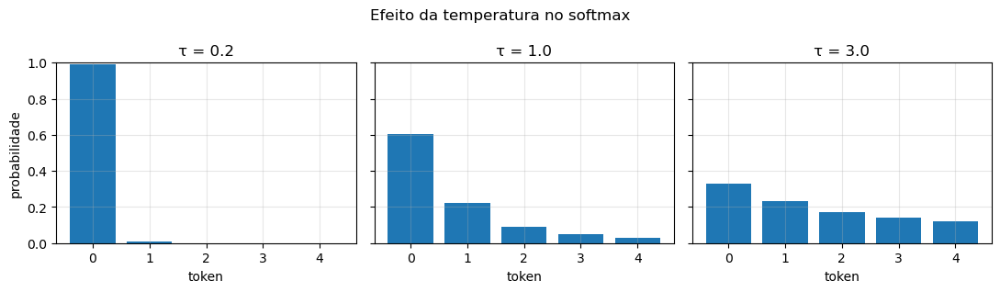

Figura 1 -- A mesma distribuição de *logits* sob três temperaturas. $\tau = 0,2$ concentra quase toda a massa no *token* mais provável; $\tau = 3,0$ aproxima-se da uniforme. Fonte: elaborada pelo autor a partir dos *notebooks* do projeto (2026).

## 2.2 Do *byte* ao vetor: tokenização e o custo do vocabulário

O condicional da Seção 2.1 é definido sobre um alfabeto discreto, e escolher esse alfabeto é a primeira decisão de projeto. Operar sobre *bytes* elimina qualquer possibilidade de *token* desconhecido, mas produz sequências longas: como o custo da atenção é quadrático no comprimento do contexto, um alfabeto pequeno demais desperdiça janela. Operar sobre palavras encurta as sequências, mas reintroduz o problema de vocabulário aberto.

O *Byte-Pair Encoding* em nível de *byte* (SENNRICH et al., 2016) resolve o dilema por compromisso: parte dos 256 *bytes* — o que garante cobertura total — e funde iterativamente o par adjacente mais frequente, aprendendo unidades de subpalavra a partir da estatística do corpus. Duas consequências mensuráveis (Figura 2): a compressão, em *bytes* por *token*, cresce com o número de fusões e satura; e a fragmentação torna-se desigual, com palavras frequentes ocupando um único *token* e termos raros dividindo-se em vários.

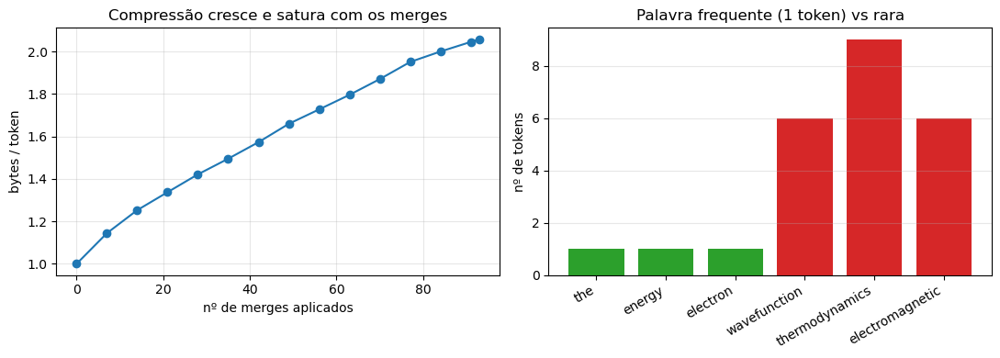

Figura 2 -- À esquerda, a razão de compressão (*bytes*/*token*) cresce e satura com o número de fusões BPE aplicadas. À direita, palavras frequentes ocupam um *token*, enquanto termos raros se fragmentam em vários. Fonte: elaborada pelo autor a partir dos *notebooks* do projeto (2026).

O tamanho do vocabulário $V$ não é livre. A tabela de *embedding* tem $V \cdot d$ parâmetros e, em modelos pequenos, essa parcela deixa de ser marginal: para $d = 512$, um vocabulário de 50 mil *tokens* consumiria fração substancial do orçamento total (Figura 3). Há também um efeito estatístico: em corpus reduzido, um vocabulário grande produz muitos *tokens* raros, cujas *embeddings* recebem poucos gradientes e permanecem mal treinadas. Adotou-se $V = 4096$ nos experimentos por essas duas razões conjugadas.

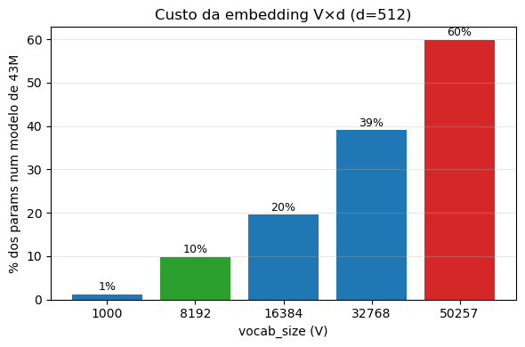

Figura 3 -- Custo da tabela de *embedding* ($V \cdot d$) como percentual dos parâmetros de um modelo de 43 M ($d = 512$), em função de $V$. Vocabulários compactos mantêm o custo controlado. Fonte: elaborada pelo autor a partir dos *notebooks* do projeto (2026).

Cada *token* é mapeado a um vetor $\mathbf{x}_{t} \in \mathbb{R}^{d}$ por consulta em tabela. Vale registrar o que essa etapa **não** faz: a *embedding* de um *token* é idêntica em todos os contextos em que ele aparece. Toda a especialização contextual é trabalho das camadas seguintes, e é isso que a próxima subseção descreve.

## 2.3 Atenção causal: condicionar a representação ao prefixo

O condicional $q_{\theta}(x_{t} \mid x_{< t})$ exige que a representação da posição $t$ dependa de todo o prefixo. O mecanismo que realiza essa dependência é uma média ponderada, aprendida, sobre as posições:

$$\mathbf{y}_{t} = \sum_{t'}A_{t,t'}\,\mathbf{x}_{t'},\qquad \sum_{t'}A_{t,t'} = 1,$$

ou, em forma matricial, $Y = AX$. A questão de projeto é inteiramente sobre a origem de $A$: os pesos precisam depender do conteúdo, para que a mesma arquitetura descubra relações diferentes em textos diferentes.

A solução é derivar $A$ da própria sequência por meio de duas projeções aprendidas, $\mathbf{q}_{t} = \mathbf{x}_{t}W_{Q}$ e $\mathbf{k}_{t} = \mathbf{x}_{t}W_{K}$, e medir compatibilidade por produto interno normalizado:

$$A_{t,t'} = \operatorname{softmax}_{t'}\left( \frac{\mathbf{q}_{t} \cdot \mathbf{k}_{t'}}{\sqrt{d_{h}}} \right).$$

Duas escolhas nessa fórmula merecem justificativa. A primeira é o uso de **duas** projeções distintas em vez do produto interno direto entre *embeddings*: com uma só, a matriz de compatibilidade seria simétrica, e a relação "A é relevante para B" ficaria indistinguível de "B é relevante para A" — uma restrição indesejável, já que a dependência sintática é tipicamente assimétrica. A segunda é o fator $1/\sqrt{d_{h}}$: o produto interno de dois vetores de dimensão $d_{h}$ com componentes de variância unitária tem variância $d_{h}$, e alimentar o *softmax* com valores dessa magnitude o saturaria, produzindo gradientes desprezíveis. A normalização mantém a variância em ordem unitária na inicialização.

Uma terceira projeção, $\mathbf{v}_{t'} = \mathbf{x}_{t'}W_{V}$, determina *o que* é transportado quando uma posição é considerada relevante, separando a decisão de "onde olhar" da de "o que trazer". A atualização resultante é $\Delta\mathbf{x}_{t} = \sum_{t'}A_{t,t'}\mathbf{v}_{t'}$.

A fatoração autoregressiva impõe uma restrição a $A$: a posição $t$ não pode consultar $t' > t$, ou o alvo estaria disponível na entrada e a perda de treino deixaria de estimar generalização. Zerar as entradas proibidas depois do *softmax* não serve, porque quebraria a normalização das linhas. A implementação correta soma $-\infty$ às entradas proibidas **antes** do *softmax*: como $e^{-\infty} = 0$, elas se anulam e cada linha continua somando 1 sobre as posições permitidas (Figura 4).

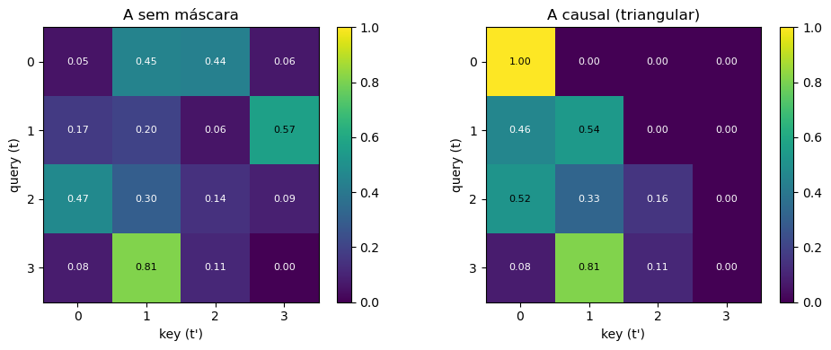

Figura 4 -- Matriz de atenção $A$ sem máscara (esquerda) e com máscara causal (direita). No caso causal, o triângulo superior é anulado: a *query* $t$ só enxerga *keys* $t' \leq t$, e cada linha continua somando 1. Fonte: elaborada pelo autor a partir dos *notebooks* do projeto (2026).

Uma única matriz $A$ força o modelo a comprimir todos os tipos de relação em um só padrão de atenção. Executar $H$ conjuntos independentes de projeções em paralelo, concatenando as saídas e projetando-as por $W_{O}$,

$$\operatorname{MHSA}(X) = \operatorname{Concat}(\operatorname{head}_{1},\ldots,\operatorname{head}_{H})\,W_{O},$$

remove essa restrição sem alterar a contagem de parâmetros, desde que $d_{h} = d/H$. O custo relevante é de memória: $A$ tem tamanho $T \times T$ por cabeça, e materializá-la é o gargalo que limita a janela de contexto.

## 2.4 Propagar sinal em profundidade: residual, escala de inicialização e RMSNorm

Empilhar $L$ blocos cria um problema de otimização independente do que cada bloco calcula: o gradiente precisa atravessar $L$ transformações para chegar às primeiras camadas. Três decisões atacam esse problema em conjunto, e é por isso que faz sentido tratá-las juntas.

**A conexão residual** transforma cada estágio em uma correção, $h \leftarrow h + f(h)$, em vez de uma substituição. Isso torna a identidade o comportamento padrão e dá ao gradiente um caminho aditivo direto até a entrada.

**A posição da normalização** determina se esse caminho permanece limpo. Normalizar depois da soma (*post-norm*) insere uma operação no caminho residual a cada bloco; normalizar antes do estágio (*pre-norm*), $h \leftarrow h + f(\operatorname{Norm}(h))$, mantém a soma intacta. A diferença é mensurável: a Figura 5 mostra a norma do gradiente que sobrevive até a entrada em função de $L$, com o *pre-norm* mantendo-se em ordem unitária enquanto o *post-norm* decai ordens de magnitude.

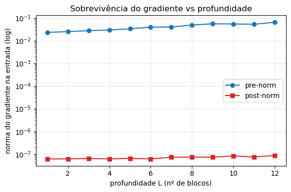

Figura 5 -- Norma do gradiente que sobrevive até a entrada, em função da profundidade $L$ (eixo vertical em escala logarítmica). O *pre-norm* mantém-se próximo de $O(1)$; o *post-norm* decai ordens de grandeza --- o *vanishing gradient*. Fonte: elaborada pelo autor a partir dos *notebooks* do projeto (2026).

**A escala de inicialização** resolve o efeito colateral do caminho aditivo. Se cada um dos $2L$ ramos somados (atenção e MLP por bloco) contribui com variância $\sigma^{2}$ e as contribuições são aproximadamente independentes, a variância do estado residual cresce linearmente com o número de ramos e sua norma como $\sqrt{2L}$. Um modelo profundo começaria, portanto, com ativações de magnitude crescente com a profundidade. A correção é reduzir a escala apenas das projeções que escrevem no caminho residual:

$$W_{\text{out\_proj}},\, W_{\text{mlp\_down}} \sim \mathcal{N}\left( 0,\left( \frac{0,02}{\sqrt{2L}} \right)^{2} \right),$$

com os demais pesos lineares em $\mathcal{N}(0,\,0,02^{2})$. O fator $1/\sqrt{2L}$ cancela exatamente o crescimento previsto, mantendo a norma em $O(1)$ no início do treino (Figura 6).

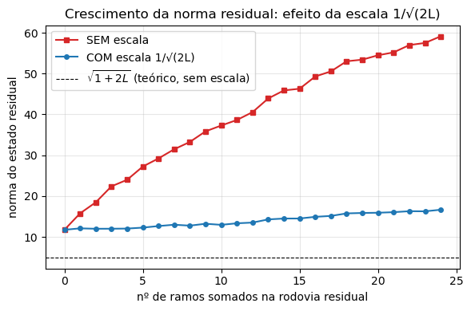

Figura 6 -- Crescimento da norma do estado residual à medida que ramos são somados. Sem escala, a norma cresce como $\sqrt{1 + 2L}$ (linha tracejada, teórica); com a escala $1/\sqrt{2L}$, mantém-se plana em $O(1)$. Fonte: elaborada pelo autor a partir dos *notebooks* do projeto (2026).

**A escolha da normalização** é o ponto em que o padrão LLaMA divergiu do GPT-2. A LayerNorm executa duas operações compostas: re-centraliza e re-escala,

$$\operatorname{LN}(x) = \gamma \odot \frac{x - \mu}{\sqrt{\sigma^{2} + \varepsilon}} + \beta.$$

Zhang e Sennrich (2019) observaram que a raiz da média dos quadrados satisfaz $\operatorname{RMS}(x)^{2} = \sigma^{2} + \mu^{2}$, de modo que ela mede simultaneamente dispersão e deslocamento. A RMSNorm mantém somente a re-escala, descartando centralização e *bias*:

$$\operatorname{RMSNorm}(x) = \gamma \odot \frac{x}{\sqrt{\frac{1}{d}\sum_{i}x_{i}^{2} + \varepsilon}}.$$

O argumento para a supressão da centralização é de **redundância funcional**, não de irrelevância: como $\parallel x \parallel_{2} = \sqrt{d}\cdot\operatorname{RMS}(x)$, a operação projeta o vetor na esfera de raio $\sqrt{d}$, preservando direção e descartando magnitude (Figura 7); e a transformação afim imediatamente seguinte pode reintroduzir qualquer deslocamento de média por meio de seu próprio *bias*. Já a magnitude — que é o que efetivamente desestabiliza o treino em redes profundas, conforme a análise da escala residual acima — permanece controlada. A Figura 8 evidencia a diferença de comportamento das duas normalizações sobre uma entrada de média elevada. Como efeito secundário, a RMSNorm elimina duas passagens sobre o vetor (o cálculo da média e a subtração), reduzindo tanto operações aritméticas quanto acessos à memória.

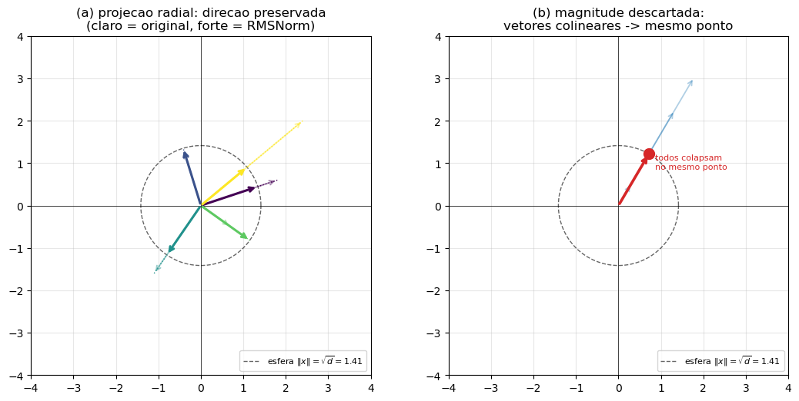

Figura 7 -- A normalização RMS como projeção radial na esfera de raio $\sqrt{d}$. À esquerda, vetores de magnitudes distintas têm o comprimento alterado, mas o ângulo preservado. À direita, vetores colineares colapsam no mesmo ponto: a magnitude é descartada. Fonte: elaborada pelo autor a partir dos *notebooks* do projeto (2026).

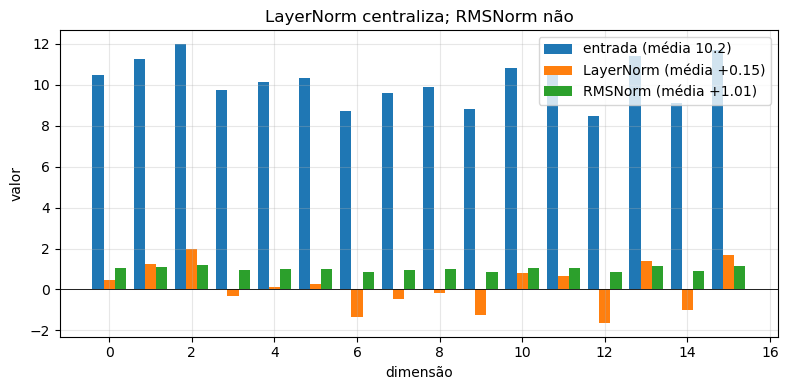

Figura 8 -- Efeito das duas normalizações sobre um vetor de entrada com média elevada: a LayerNorm centraliza (média $\approx 0$), a RMSNorm não. Fonte: elaborada pelo autor a partir dos *notebooks* do projeto (2026).

Há uma ressalva de implementação com consequência numérica: a soma de $d$ quadrados acumula erro quando executada em precisão reduzida. No pacote, o denominador é calculado em FP32 mesmo sob treino em BF16, com retorno ao tipo original apenas ao final.

## 2.5 Capacidade por parâmetro: SwiGLU e compartilhamento de pesos

A atenção move informação entre posições; a segunda metade de cada bloco refina cada posição isoladamente, com os mesmos pesos em todas elas. Apesar de receber menos atenção conceitual, é aqui que reside a maior parte dos parâmetros do modelo, o que torna a eficiência dessa sub-rede economicamente decisiva.

A formulação do GPT-2 é uma composição de duas transformações lineares com não linearidade intermediária, $\operatorname{GELU}(xW_{1})W_{2}$, com expansão de fator 4 e portanto $8d^{2}$ parâmetros. A família *Gated Linear Units* (DAUPHIN et al., 2017) substitui essa composição por uma estrutura multiplicativa: dois ramos lineares paralelos, um dos quais modula o outro elemento a elemento, $\operatorname{GLU}(x) = \sigma(xW) \odot (xV)$. A variante adotada pelo LLaMA emprega a ativação SiLU e três projeções sem *bias*:

$$\operatorname{SwiGLU}(x) = \left( \operatorname{SiLU}(xW_{g}) \odot (xW_{u}) \right)W_{d}.$$

A comparação com a MLP clássica só é informativa se o orçamento de parâmetros for igualado — do contrário, qualquer ganho poderia ser atribuído a capacidade extra. Impondo $3 \cdot d \cdot h = 8d^{2}$ obtém-se $h = 8d/3$, e é sob essa restrição que Shazeer (2020) relata melhoria consistente. O autor é explícito quanto ao caráter empírico do resultado; a explicação mais aceita é estrutural: o ramo não ativado oferece um percurso linear direto, enquanto o produto entre dois ramos lineares gera interações de segunda ordem que uma composição com não linearidade pontual não representa com a mesma economia. Na prática, $h$ é arredondado para o múltiplo de 64 imediatamente superior, $h = 64\lceil(8d/3)/64\rceil$, por razões de eficiência de *kernel* em GPU — a mesma prática adotada na implementação de referência do LLaMA.

Uma segunda economia opera na fronteira do modelo. A matriz que converte a representação final em *logits* tem exatamente a forma transposta da tabela de *embedding*, e ambas relacionam o mesmo vocabulário ao mesmo espaço latente. Compartilhá-las (*weight tying*) elimina $V \cdot d$ parâmetros — em modelos pequenos, uma fração relevante do total, como quantificado na Figura 3.

## 2.6 Codificar posição sem gastar parâmetros: RoPE

A operação da Seção 2.3 é invariante a permutação: reordenar as posições de entrada reordena as saídas sem alterar seus valores. Como a ordem das palavras carrega significado, a informação posicional precisa ser injetada explicitamente.

A solução do GPT-2 é somar à *embedding* de conteúdo um vetor posicional aprendido, $h_{0} = \operatorname{Embed}(x_{t}) + \operatorname{PosEmbed}(t)$. Três limitações decorrem dessa escolha: consome $T_{\max} \cdot d$ parâmetros; não define comportamento para $t \geq T_{\max}$, impedindo extrapolação; e sobrepõe conteúdo e posição no mesmo vetor, obrigando as camadas seguintes a separá-los.

A codificação rotacional (SU et al., 2021) parte de uma observação distinta: o que a atenção consome não são as *embeddings*, mas produtos internos entre *queries* e *keys*. Basta, portanto, que a posição afete o produto interno — e a operação que altera produtos internos preservando normas é a rotação. Tratando pares de dimensões $(2i,\,2i+1)$ como planos, aplica-se

$$R(\theta) = \begin{pmatrix} \cos\theta & -\sin\theta \\ \sin\theta & \cos\theta \end{pmatrix},$$

com ângulo proporcional à posição e frequências $\theta_{i} = b^{-2i/d_{h}}$, $b = 10000$. O espectro de frequências é o que dá à construção sua expressividade: os pares de baixa dimensão giram rápido e resolvem ordem local, enquanto os de alta dimensão giram lentamente e codificam estrutura de longo alcance (Figura 9).

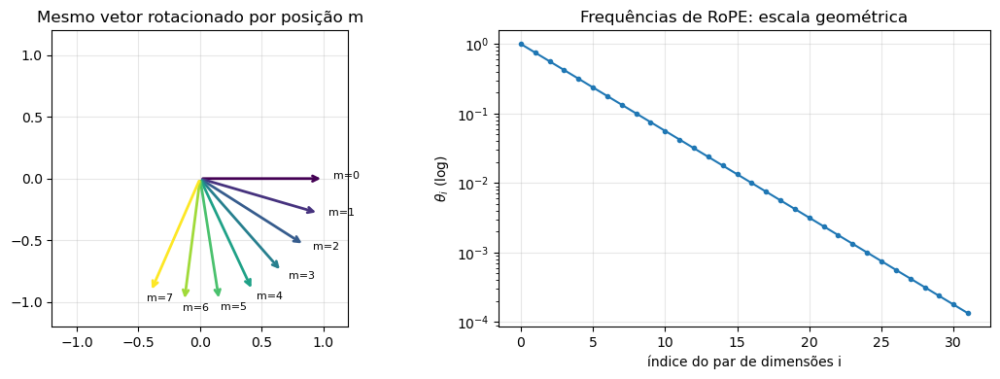

Figura 9 -- RoPE como rotação. À esquerda, o mesmo vetor rotacionado por posições crescentes $m$. À direita, as frequências $\theta_{i} = b^{-2i/d_{h}}$ em escala semilogarítmica. Fonte: elaborada pelo autor a partir dos *notebooks* do projeto (2026).

A propriedade que justifica o método decorre da estrutura do grupo de rotações. Com $Q'_{m} = R_{m}Q_{m}$ e $K'_{n} = R_{n}K_{n}$, e usando $R_{m}^{\top}R_{n} = R_{n - m}$,

$$\langle Q'_{m},\,K'_{n}\rangle = Q_{m}^{\top}R_{m}^{\top}R_{n}K_{n} = Q_{m}^{\top}R_{n - m}K_{n}.$$

A pontuação de atenção passa a depender apenas da distância $n - m$, e não das posições absolutas. Isso resolve as três limitações de uma vez: nenhum parâmetro é aprendido, o deslocamento é definido para qualquer posição, e conteúdo e posição permanecem separados, já que a rotação é aplicada dentro da atenção e não à *embedding*. A Figura 10 verifica numericamente a invariância à translação.

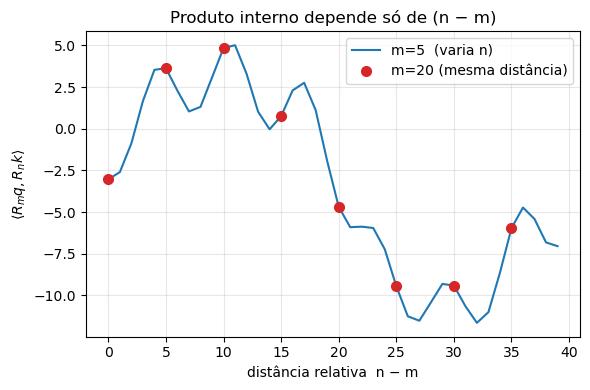

Figura 10 -- Produto interno $\langle R_{m}q,\,R_{n}k\rangle$ em função da distância relativa $n - m$. Os pontos, calculados para posições absolutas distintas, caem sobre a mesma curva: só a distância importa. Fonte: elaborada pelo autor a partir dos *notebooks* do projeto (2026).

## 2.7 Custo de inferência: KV-cache

As decisões anteriores otimizam treino. A geração tem um perfil de custo próprio, e ignorá-lo produz uma implementação assintoticamente pior que o necessário.

Na geração ingênua, cada novo *token* dispara um *forward* completo sobre a sequência acumulada, recalculando $Q$, $K$ e $V$ de todas as posições anteriores. Produzir $N$ *tokens* a partir de um prefixo de tamanho $p$ custa $O(L \cdot d^{2} \cdot N \cdot (p + N))$ — quadrático em $N$.

O desperdício é identificável a partir da máscara causal: se a posição $i$ nunca consulta posições posteriores, então $K_{i}$ e $V_{i}$ não podem mudar quando o modelo processa $t > i$. São, portanto, invariantes ao longo da geração e podem ser retidos em memória. Cada passo recalcula apenas a linha nova e a concatena ao que já existe, reduzindo o custo a $O(L \cdot d^{2} \cdot N)$, linear (Figura 11). O compromisso é memória: o cache cresce com $2 \cdot L \cdot T \cdot d$ valores.

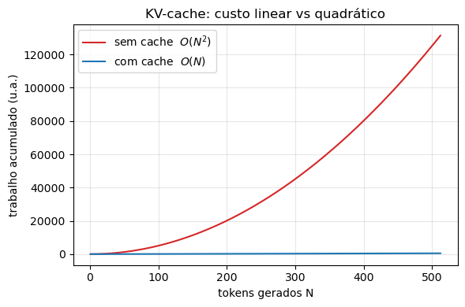

Figura 11 -- Custo acumulado das projeções $Q,K,V$ para gerar $N$ *tokens*: sem cache, o crescimento é quadrático; com cache, linear. Fonte: elaborada pelo autor a partir dos *notebooks* do projeto (2026).

Duas consequências desse arranjo são fonte recorrente de defeito silencioso, e ambas são cobertas por testes de invariância (Seção 3.7). A primeira é que, no passo de decodificação, a *query* tem comprimento 1 enquanto as *keys* têm comprimento crescente: a matriz de atenção deixa de ser quadrada e a máscara causal não deve ser aplicada — a única *query* existente pode legitimamente consultar todo o cache. Condicionar a máscara à igualdade $|Q| = |K|$ resolve. A segunda é que a rotação RoPE do *token* novo depende de sua posição **global**, não de seu índice dentro do tensor de entrada, que é sempre zero. Ignorar esse deslocamento produz um modelo que gera texto plausível mas inconsistente com o *forward* sem cache — falha que só um teste de equivalência numérica detecta.

## 2.8 Entropia do corpus e o piso da perda

As seções anteriores tratam de capacidade. Esta trata do limite que nenhuma capacidade remove, e é a base formal da hipótese experimental deste trabalho.

Seja $p$ a distribuição condicional verdadeira que gera o corpus e $q_{\theta}$ o modelo. A entropia cruzada esperada decompõe-se exatamente em

$$\mathcal{L}(\theta) = \mathbb{E}_{p}\left[ -\log q_{\theta} \right] = H(p) + D_{\mathrm{KL}}\left( p \,\|\, q_{\theta} \right).$$

A leitura dessa identidade é o ponto central. O segundo termo é o erro do modelo: mede o quanto $q_{\theta}$ difere de $p$, é não negativo e anula-se apenas no ajuste perfeito. É sobre ele que capacidade, arquitetura e otimização atuam. O primeiro termo, no entanto, é uma propriedade **do corpus**, não do modelo: é a incerteza intrínseca da fonte, e nenhum aumento de parâmetros, dados ou *compute* a reduz.

Duas predições decorrem daí. Primeiro, corpora distintos têm pisos distintos, e comparar perdas absolutas entre domínios diferentes é comparar réguas diferentes. Segundo — e é o que a leitura puramente de escala não prevê —, trocar o corpus por um de $H(p)$ menor não apenas baixa o piso: também encurta a distância que o termo KL precisa cobrir, porque distribuições mais concentradas são representáveis por famílias paramétricas menores. Em regime de capacidade severamente limitada, onde $D_{\mathrm{KL}}$ está longe de zero, essa segunda parcela pode dominar. É exatamente essa a hipótese testada na Seção 4.3.

O obstáculo é que $H(p)$ não é observável: sua estimação exigiria conhecer dependências de ordem arbitrária. O que é computável são as entropias condicionais de ordem finita, que formam uma sequência não crescente e limitam superiormente a taxa de entropia $h$ da fonte:

$$H_{1} = H(x_{t}) \;\geq\; H_{2} = H(x_{t} \mid x_{t - 1}) \;\geq\; \cdots \;\geq\; h.$$

Duas dessas quantidades são úteis operacionalmente. $H_{1}$ mede a concentração da distribuição marginal de *tokens*. $H_{2}$ tem interpretação mais direta: é exatamente a perda que um contador de bigramas atinge sobre os dados em que foi estimado, e portanto **a referência que um modelo precisa bater para ter aprendido algo além de coocorrência local**. Essa referência é bem mais informativa que o piso trivial $\log V$, que corresponde a um modelo que nada aprendeu e é fácil de superar. A Seção 3.4 detalha como esses proxies foram medidos e quais ressalvas de estimação se aplicam.

Vale localizar este argumento em relação à literatura de escalonamento. Hoffmann et al. (2022) caracterizam a alocação ótima de *compute* entre parâmetros e *tokens*, obtendo $T^{*} \approx 20N$; a razão $T/N$ diagnostica se um treino tem parâmetros em excesso para os dados disponíveis. Esse resultado é sobre a fronteira eficiente, com a distribuição dos dados tomada como dada. Eldan e Li (2023) atacam o eixo complementar: mostram que modelos de 1 a 33 milhões de parâmetros produzem texto fluente quando a distribuição do corpus é suficientemente simples, construindo o TinyStories precisamente para demonstrá-lo. O presente trabalho situa-se nesse segundo eixo e acrescenta a medição que falta — a separação quantitativa entre o efeito do domínio e o efeito do volume, com o segundo mantido constante por construção.

# 3 Metodologia

## 3.1 Organização do sistema

O código está organizado por estágio de *pipeline*, e não por tipo de artefato, de modo que a estrutura de diretórios espelhe o fluxo do problema: `tokenizer → data → model → training → inference`. Cada estágio é importável e testável isoladamente. Duas decisões complementares sustentam a reprodutibilidade: hiperparâmetros residem em uma camada de configuração única (`config.py` mais arquivos YAML), sem valores padrão espalhados pelo código; e todo caminho de entrada ou saída é recebido por injeção, nunca fixado internamente. A serialização usa formatos de dados puros — JSON para o tokenizador, dicionários de tensores para *checkpoints* — em vez de `pickle` de objetos, o que evita acoplar artefatos persistidos à versão do código que os produziu.

O projeto materializa-se em duas camadas. A **educacional** consiste em oito *notebooks* numerados que derivam cada componente com a formulação matemática ao lado do código executável; não são editados à mão, e sim gerados por *builders* versionados, o que mantém a camada didática sob controle de versão de forma legível. A **de produção** é o pacote `src/tucanoce/`, que consolida o que cada *notebook* deriva.

## 3.2 Arquitetura e *presets*

O modelo é um *Transformer decoder-only* com as decisões descritas na Seção 2. Os hiperparâmetros de capacidade são expostos como *presets* nomeados (Tabela 1), o que permite variar escala mantendo o restante do *pipeline* literalmente idêntico — condição necessária para que qualquer comparação isole o fator pretendido.

Tabela 1 -- *Presets* de arquitetura.

  *Preset*   $d$ (embed)   $L$ (camadas)   $H$ (cabeças)   Parâmetros
  ---------- ------------- --------------- --------------- ------------
  small      128           6               4               1,80 M
  base       256           8               8               ---
  medium     512           12              8               42,7 M
  large      768           12              12              91,2 M
  xl         1024          16              16              210,8 M

Fonte: elaborada pelo autor (2026).

A distribuição de parâmetros por componente (Figura 12) confirma o que a Seção 2.5 antecipa: a maior parcela reside na MLP, seguida da atenção, e não na *embedding* — cujo peso é compartilhado com a projeção de saída.

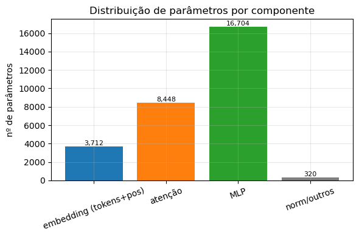

Figura 12 -- Distribuição de parâmetros por componente. A MLP concentra a maior parcela, seguida da atenção. Fonte: elaborada pelo autor a partir dos *notebooks* do projeto (2026).

Todos os experimentos reportados usam o *preset small* (1.803.904 parâmetros), o único treinável em tempo hábil na infraestrutura disponível (CPU), e mantido **fixo** em todo o estudo. Os *presets* maiores estão implementados e testados, mas não treinados; a referência mais próxima para eles é Cunha (2026), que reporta perda de validação de aproximadamente 2,13 para o *preset* de 43 milhões sobre 25,3 milhões de *tokens* de Wikipedia técnica em RTX 5070.

## 3.3 *Pipeline* de dados e particionamento

Todos os corpora passam pelo mesmo *pipeline*: coleta, limpeza, tokenização por BPE em nível de *byte* — cujo artefato versionado são as regras de fusão — e particionamento em janelas de contexto. O cache de *tokens* é invalidado por dois critérios conjuntos, identidade do tokenizador e data de modificação do corpus, porque verificar apenas um deles deixa passar exatamente as duas situações que ocorrem na prática: re-limpar o corpus sem retreinar o tokenizador, e retreinar o tokenizador sem alterar o corpus.

A decisão de maior impacto no particionamento é o passo entre janelas de tamanho $T_{ctx}$. A janela deslizante de passo 1 gera $|\mathcal{D}| = N - T_{ctx}$ amostras; a contígua, de passo $T_{ctx}$, gera

$$|\mathcal{D}|_{\text{chunked}} = \left\lfloor \frac{N - 1}{T_{ctx}} \right\rfloor,$$

com cada *token* visto uma única vez por época. A razão entre as duas é aproximadamente $T_{ctx}$ (Figura 13). Adotou-se a estratégia contígua, e a justificativa é estatística antes de ser computacional: janelas deslocadas de uma posição compartilham $T_{ctx} - 1$ *tokens*, de modo que amostras consecutivas são quase idênticas e o gradiente que produzem é fortemente correlacionado. O custo por época cai cerca de duas ordens de grandeza em troca de redundância, não de informação.

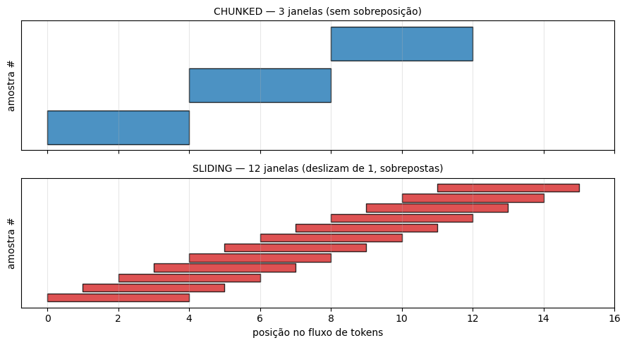

Figura 13 -- Particionamento do mesmo fluxo de *tokens* ($N = 16$, $T_{ctx} = 4$). O modo contíguo (topo) usa janelas sem sobreposição; o deslizante (base) desloca de um em um, gerando janelas quase idênticas. Fonte: elaborada pelo autor a partir dos *notebooks* do projeto (2026).

## 3.4 Caracterização quantitativa da entropia dos corpora

Afirmar que um corpus é "mais simples" que outro é insuficiente para sustentar a hipótese da Seção 2.8; a propriedade precisa ser medida. Quatro proxies foram calculados para cada corpus, sobre o fluxo de *tokens* efetivamente usado no treino, por `scripts/entropia_corpora.py`:

1. **Compressão em *bytes* por *token*.** Quanto mais previsível o texto, mais o BPE consegue comprimi-lo em unidades longas.
2. **Tipos usados.** Número de identificadores do vocabulário que efetivamente ocorrem, indicando quanto do espaço disponível o corpus mobiliza.
3. **Entropia de unigrama** $H_{1} = -\sum_{x} \hat{p}(x)\log\hat{p}(x)$, em *nats*/*token*, medindo a concentração da distribuição marginal.
4. **Entropia condicional de bigrama** $H_{2} = -\sum_{a,b} \hat{p}(a,b)\log\hat{p}(b \mid a)$, a perda de um contador de bigramas.

Três ressalvas de estimação delimitam o que essas quantidades sustentam. Primeira: $H_{1}$ e $H_{2}$ são estimadores *plug-in* calculados sobre a mesma amostra, e portanto enviesados para baixo — subestimam os valores populacionais, tanto mais quanto menor o corpus. Segunda: como consequência, a comparação legítima é **relativa** entre corpora, já que os três foram calculados de forma idêntica, e não absoluta contra um valor teórico. Terceira: a margem $H_{2} - \mathcal{L}_{val}$ usada na Seção 4 confronta uma quantidade *in-sample* ($H_{2}$) com uma *held-out* ($\mathcal{L}_{val}$); como um contador de bigramas avaliado fora da amostra teria perda **maior** que seu $H_{2}$ *in-sample*, a margem reportada é um limite **inferior** da vantagem real do modelo sobre esse *baseline* — ou seja, erra na direção conservadora.

Os corpora são três. O primeiro reúne 154 artigos de física de partículas coletados da Wikipedia em inglês. A curadoria mostrou-se determinante nessa etapa: a inspeção revelou que os extratos carregavam marcação matemática TeX/MathML correspondente a cerca de 28 % do texto, o que induzia o modelo a reproduzir LaTeX em vez de prosa; a remoção passou a integrar a rotina de limpeza. O segundo, de 166 artigos de *machine learning*, foi coletado pelo mesmo *pipeline*. O terceiro é um subconjunto de 8.000 histórias do TinyStories (ELDAN; LI, 2023), corpus sintético de vocabulário deliberadamente restrito.

## 3.5 Protocolo do estudo controlado e da ablação

O estudo tem dois estágios, e o segundo existe porque o primeiro, isoladamente, é confundido.

**Estágio 1 — variação de domínio.** O mesmo *preset small* foi treinado sobre os três corpora, mantidos idênticos a arquitetura, o tamanho-alvo de vocabulário ($V = 4096$), o comprimento de contexto (128), a estratégia de particionamento e a fração de validação (10 %). Variou-se o corpus.

**Estágio 2 — ablação de volume.** O estágio 1 não permite atribuir o efeito à entropia, porque o subconjunto do TinyStories tem 2.914.240 *tokens* contra 415.878 do corpus de física — um fator de sete. Volume e entropia variam juntos. A ablação (`scripts/ablacao_entropia_volume.py`) quebra o confundimento truncando o fluxo de *tokens* do TinyStories em **exatamente** 415.878 posições, o volume do corpus de física, e treinando com os hiperparâmetros do *run* de física (12 épocas, paciência 4, lote 16). Nessa condição, corpus é o único fator que varia entre as duas execuções, e a diferença de perda estima o efeito da entropia com o volume controlado. A diferença entre TinyStories truncado e completo estima o efeito do volume com a entropia controlada. A semente do gerador aleatório é fixada, e as métricas por época são persistidas em JSON — sem isso, o número reportado não é reproduzível e a curva de treino não é auditável.

Uma limitação do desenho deve ser explicitada: a execução de controle ainda apresentava melhora de perda ao atingir o teto de 12 épocas, de modo que seu valor final é um limite superior para a perda alcançável naquela condição. O efeito atribuído à entropia é, por consequência, uma estimativa conservadora.

## 3.6 Procedimento de treino

O objetivo é a entropia cruzada da Seção 2.1, otimizada por AdamW (LOSHCHILOV; HUTTER, 2019) com taxa máxima $6 \times 10^{-4}$ e $\beta = (0,9;\,0,999)$. Os parâmetros são separados em dois grupos: matrizes recebem *weight decay* $0,1$; vetores unidimensionais — *biases* e ganhos de normalização — recebem decaimento nulo. A razão é que penalizar o ganho $\gamma$ de uma normalização não regulariza a função aprendida, apenas distorce a escala repassada à camada seguinte, que é justamente o parâmetro cuja liberdade a normalização existe para preservar.

A taxa de aprendizado é agendada em duas fases (Figura 14): crescimento linear durante o *warmup* de $T_{w} = \min(T/10,\,2000)$ passos, seguido de decaimento por cosseno até $\eta_{\min} = 0,1\,\eta_{\max}$:

$$\eta(t) = \begin{cases} \eta_{\max}\dfrac{t}{T_{w}}, & t < T_{w} \\[2mm] \eta_{\min} + (\eta_{\max} - \eta_{\min})\dfrac{1}{2}\left( 1 + \cos\left( \pi\dfrac{t - T_{w}}{T - T_{w}} \right) \right), & T_{w} \leq t \leq T. \end{cases}$$

O *warmup* atende a uma condição transitória: nos primeiros passos as estimativas de momento do AdamW são pouco confiáveis, e passos grandes sob estimativas ruidosas deslocam os pesos para regiões de onde a otimização não recupera. Completam o laço o recorte de gradiente por norma global, a acumulação de gradiente — que desacopla o lote estatístico do lote que cabe em memória —, precisão BF16 quando em GPU, e parada antecipada por paciência com retenção do melhor *checkpoint*.

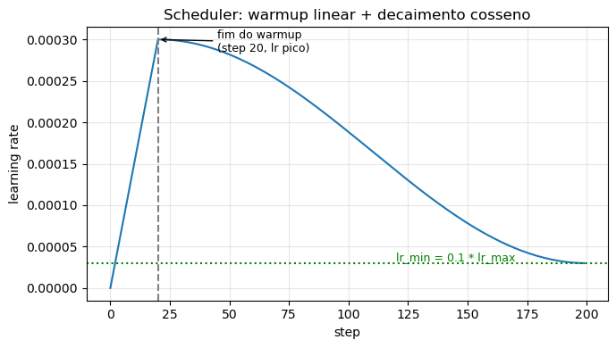

Figura 14 -- Agendamento da taxa de aprendizado: *warmup* linear seguido de decaimento por cosseno até $\eta_{\min} = 0,1\,\eta_{\max}$. Fonte: elaborada pelo autor a partir dos *notebooks* do projeto (2026).

## 3.7 Verificação por invariâncias

A correção de uma implementação de *Transformer* é difícil de verificar por inspeção, porque a maior parte dos defeitos não gera exceção: produz um modelo que treina, converge e gera texto plausível, apenas pior do que deveria. A estratégia adotada foi testar **invariâncias** — propriedades que a implementação correta satisfaz por construção e que uma incorreta viola de forma detectável. A suíte tem 78 testes, organizados nas classes da Tabela 2.

Tabela 2 -- Classes de invariância verificadas.

  Classe                     Invariância verificada                                          Testes
  -------------------------- --------------------------------------------------------------- --------
  Tokenizador                `decode(encode(s)) == s` para texto arbitrário                   8
  Causalidade                alterar $x_{t}$ não altera saídas em posições $< t$              4
  RoPE                       pontuação depende só de $n - m$; rotação preserva norma          6
  KV-cache                   *decode* incremental $\equiv$ *forward* completo                 9
  Normalização               RMSNorm projeta na esfera; estabilidade em precisão reduzida     6
  SwiGLU                     contagem de parâmetros e arredondamento de $h$                   5
  Configuração               *presets*, derivação de $h$, carga de YAML                       10
  Bloco e modelo             formas, fluxo de gradiente, *weight tying* deduplicado           10
  Dados                      contagem de janelas por estratégia de passo                      5
  Limpeza                    remoção de marcação e de seções não textuais                     6
  Treino e avaliação         agendamento, recorte, cálculo de perda e acurácia                 9

Fonte: elaborada pelo autor (2026).

A classe de maior valor diagnóstico é a do KV-cache: a geração incremental é comparada ao *forward* completo sobre a mesma sequência, exigindo-se concordância numérica com erro inferior a $5 \times 10^{-7}$. É o único teste que detecta as duas falhas descritas na Seção 2.7, ambas silenciosas sob qualquer inspeção qualitativa da saída.

## 3.8 Avaliação e *benchmark*

A entropia cruzada crua não é interpretável isoladamente, e as duas referências usadas neste trabalho têm poder discriminante muito diferente. O piso trivial é a perda de um modelo uniforme sobre o vocabulário, $\log V$, o que dá $\approx 8,32$ *nats* para $V = 4096$; superá-lo é condição necessária e pouco informativa. A referência efetivamente usada é $H_{2}$ (Seção 2.8), a perda de um contador de bigramas do próprio corpus.

Para comparar modelos com tokenizadores distintos, nenhuma métrica por *token* serve: mudar o vocabulário muda a unidade de contagem, e a *perplexity* por *token* deixa de ser comparável. A métrica correta normaliza pela extensão do texto cru — *bits* por *byte*:

$$\operatorname{BPB} = \frac{\mathcal{L}_{\text{tot}}}{B\ln 2},$$

para uma perda total $\mathcal{L}_{\text{tot}}$ em *nats* sobre um texto de $B$ *bytes*. O *benchmark* mede o BPB do TucanoCE e do GPT-2 sobre o **mesmo texto cru**: 150 histórias do TinyStories, inéditas para ambos os modelos por razões distintas — constituem conjunto *held-out* para o TucanoCE, treinado em 8.000 histórias diferentes do mesmo corpus (avaliação *in-distribution*), e situam-se fora do domínio de treino do GPT-2, que nunca viu o TinyStories (*zero-shot*). Cada modelo é avaliado com janela deslizante em seu próprio comprimento de contexto.

# 4 Resultados

## 4.1 Caracterização dos corpora

A Tabela 3 apresenta os quatro proxies medidos. Os corpora técnicos são consistentemente mais complexos que o TinyStories em todas as medidas: comprimem menos (4,04 e 3,50 contra 2,29 *bytes*/*token*), mobilizam mais tipos por *token*, e têm entropias de unigrama e de bigrama mais altas. A separação em $H_{2}$ é de aproximadamente 0,3 *nat*, e a razão tipo/*token* difere por um fator de sete — evidência de que a diferença qualitativa entre "prosa técnica" e "história infantil" tem correlato quantitativo estável.

Tabela 3 -- Caracterização dos corpora ($V = 4096$).

  Corpus                 Tokens      *Bytes*/*token*   Tipos   $H_{1}$   $H_{2}$
  ---------------------- ----------- ----------------- ------- --------- ---------
  Física de partículas   415.878     4,04              3.859   4,805     3,269
  Machine learning       590.377     3,50              3.900   4,854     3,340
  TinyStories            2.914.240   2,29              3.766   4,046     2,995

Fonte: elaborada pelo autor (2026), por `scripts/entropia_corpora.py`.

## 4.2 Efeito do domínio do corpus

Treinado sobre os três corpora com tudo o mais idêntico, o *preset small* produz o resultado da Tabela 4 e da Figura 15: a perda permanece praticamente inalterada entre física (3,087) e *machine learning* (3,017), mas cai para 1,586 no TinyStories — redução de 48,6 % sem qualquer alteração no modelo.

Tabela 4 -- Treino do mesmo modelo (1,8 M) em três corpora.

  Corpus                 Tokens      Melhor $\mathcal{L}_{val}$   Acurácia   $H_{2} - \mathcal{L}_{val}$
  ---------------------- ----------- ---------------------------- ---------- -----------------------------
  Física de partículas   415.878     3,087                        0,50       0,18
  Machine learning       590.377     3,017                        0,49       0,32
  **TinyStories**        2.914.240   **1,586**                    **0,66**   **1,41**

Fonte: elaborada pelo autor (2026).

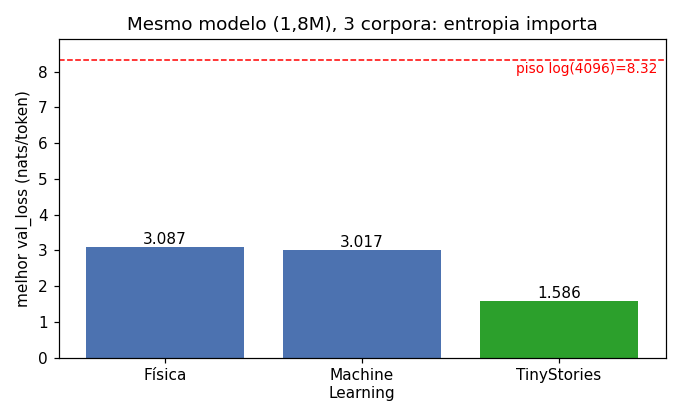

Figura 15 -- Melhor perda de validação do mesmo modelo de 1,8 M sobre três corpora, contra o piso trivial $\log(4096)$. Fonte: elaborada pelo autor (2026).

A última coluna da Tabela 4 é mais informativa que a perda absoluta. Nos corpora técnicos, o modelo supera um contador de bigramas por 0,18 e 0,32 *nat* — margens pequenas, e ainda por cima limites inferiores conservadores (Seção 3.4). No TinyStories a margem é de 1,41 *nat*. A leitura é qualitativa, não apenas de grau: nos textos técnicos, um modelo de 1,8 milhão de parâmetros captura pouco além de estatística de coocorrência local, enquanto no corpus de baixa entropia ele modela estrutura de alcance mais longo. Isso explica a diferença observada na geração melhor do que a perda sozinha.

O contraste qualitativo é direto. A partir do *prompt* "*Once upon a time*", o modelo treinado no TinyStories produz texto gramatical e coerente:

> *"Once upon a time, there was a little girl named Lily. She loved to play outside with her dolls, but it was big and soft. One day, Lily's mom made..."*

Nos corpora técnicos, o mesmo modelo produz apenas jargão sintaticamente quebrado. O treino no TinyStories convergiu de forma estável, sem sinal de sobreajuste até a última época (Figura 16).

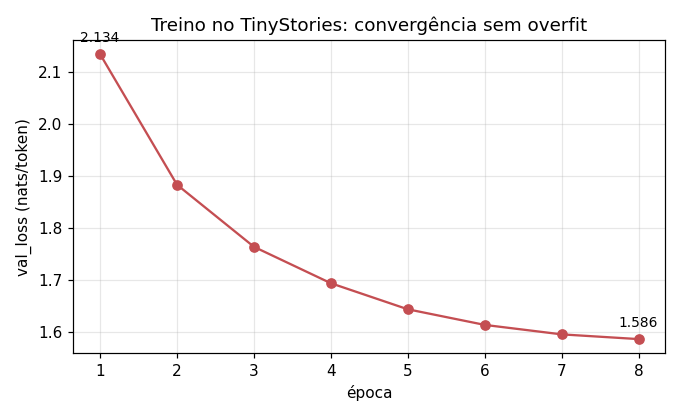

Figura 16 -- Curva de treino no TinyStories: a perda de validação decresce de forma monótona até a época 8. Fonte: elaborada pelo autor (2026).

## 4.3 Ablação: entropia do corpus ou volume de dados?

O resultado da Seção 4.2 é compatível com duas explicações, porque o TinyStories difere do corpus de física em ambos os fatores. A ablação da Seção 3.5 os separa. Truncado a 415.878 *tokens* — exatamente o volume do corpus de física — e treinado com os mesmos hiperparâmetros, o TinyStories produz perda de validação de **1,823** com acurácia de 0,632 (Tabela 5, Figura 17).

Tabela 5 -- Ablação: entropia do corpus contra volume de dados (*preset small*, 1,8 M).

  Condição                              Tokens      $H_{2}$   $\mathcal{L}_{val}$   Acurácia
  ------------------------------------- ----------- --------- --------------------- ----------
  Física de partículas                  415.878     3,269     3,087                 0,500
  TinyStories truncado (**controle**)   415.878     2,995     **1,823**             0,632
  TinyStories completo                  2.914.240   2,995     1,586                 0,660

Fonte: elaborada pelo autor (2026), por `scripts/ablacao_entropia_volume.py`.

A decomposição do efeito total é imediata. A queda de 3,087 para 1,586 totaliza 1,501 *nat*. Dela:

- **1,264 *nat* (84 %)** ocorre entre física e TinyStories truncado, com o volume mantido fixo em 415.878 *tokens*. Nada mudou além do domínio do texto: é o efeito da entropia, isolado.
- **0,237 *nat* (16 %)** ocorre entre TinyStories truncado e completo, com a entropia fixa e o volume multiplicado por sete: é o efeito do volume, isolado.

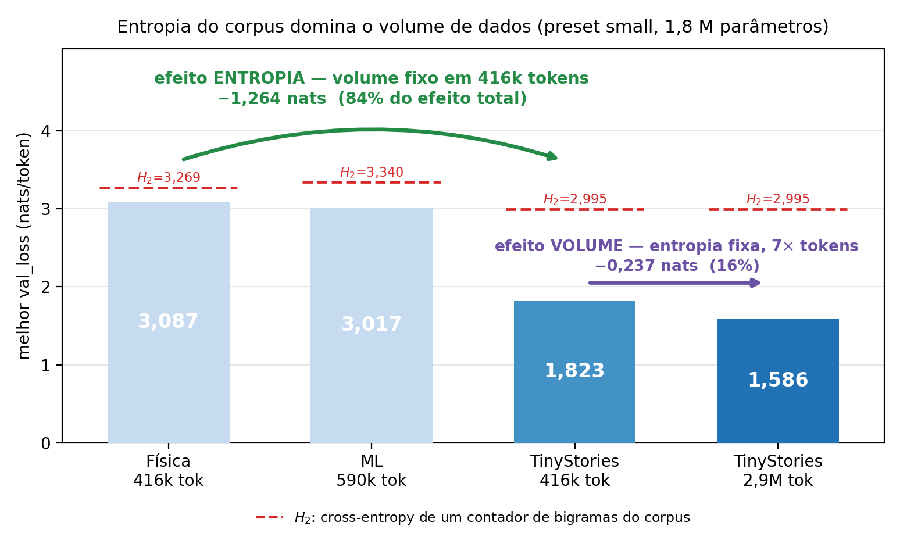

Figura 17 -- Decomposição do efeito total. As duas primeiras barras e a terceira têm o mesmo volume (415.878 *tokens*): a diferença entre elas é entropia. A terceira e a quarta têm a mesma entropia: a diferença é volume. Linhas tracejadas marcam $H_{2}$. Fonte: elaborada pelo autor (2026).

Três observações qualificam o número. Primeira, o efeito da entropia é subestimado: a execução de controle ainda melhorava no teto de 12 épocas (Figura 18), de modo que 1,264 *nat* é um limite inferior. Segunda, a coerência da geração não depende do volume — com apenas 415.878 *tokens*, o controle já produz narrativa bem-formada ("*Once upon a time, there was a little girl named Lily. She loved to play outside and explore the sky!*"), o que localiza o salto qualitativo na troca de domínio, não no acúmulo de dados. Terceira, o controle supera $H_{2}$ do TinyStories por 1,17 *nat*, contra 0,18 do corpus de física com volume idêntico — a diferença de margem sobre o *baseline* de bigramas persiste quando o volume é controlado, o que descarta a hipótese de que aquela margem estreita fosse um artefato de corpus pequeno.

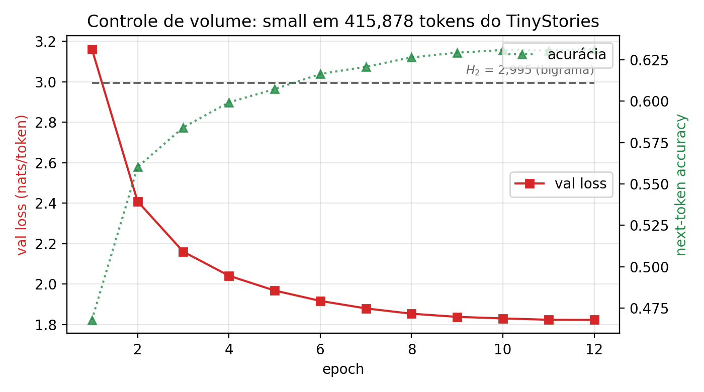

Figura 18 -- Curva da execução de controle (415.878 *tokens* do TinyStories). A perda ainda decresce na última época, indicando que o valor final é um limite superior. Fonte: elaborada pelo autor (2026).

## 4.4 Comparação com o GPT-2

O modelo especialista foi comparado ao GPT-2 (124 milhões de parâmetros, *zero-shot*) sobre 150 histórias inéditas, em *bits* por *byte* (Tabela 6, Figura 19).

Tabela 6 -- *Benchmark* sobre 150 histórias *held-out* do TinyStories.

  Métrica                       TucanoCE    GPT-2
  ----------------------------- ----------- -------------------
  Parâmetros                    1.803.904   124.439.808
  Treinou em TinyStories?       sim         não (*zero-shot*)
  Contexto (*tokens*)           128         1024
  **BPB (bits/byte)** ↓         1,013       **0,772**
  Geração (*tokens*/s, CPU) ↑   **371,5**   33,6

Fonte: elaborada pelo autor (2026).

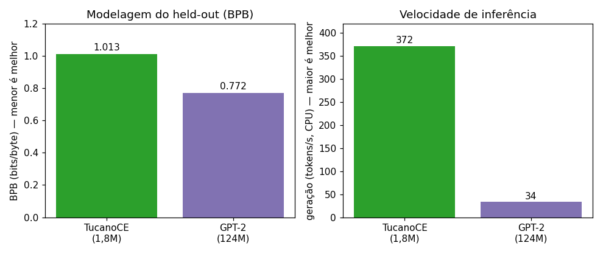

Figura 19 -- Comparação TucanoCE contra GPT-2 no *held-out*: BPB (esquerda, menor é melhor) e velocidade de geração em CPU (direita, maior é melhor). Fonte: elaborada pelo autor (2026).

O GPT-2 obtém BPB menor, o que é o esperado de um modelo 69 vezes maior. Três ressalvas qualificam a leitura desse número. Primeira, parte da vantagem é **estrutural** e não decorre de melhor modelagem: o GPT-2 dispõe de contexto oito vezes maior e de um vocabulário de 50.257 *tokens*, que fragmenta menos o texto e reduz *bits* por *byte* quase mecanicamente. Segunda, o BPB mede **compressão, não adequação à tarefa**: solicitado a gerar uma história a partir do mesmo *prompt*, o GPT-2 ignora o gênero e entra em laço incoerente ("*...the evil human mind of the evil human mind...*"), enquanto o especialista de 1,8 milhão produz narrativa no estilo correto. Terceira, o especialista fica a cerca de 31 % do BPB do GPT-2 tendo visto aproximadamente cinco mil vezes menos dados, e gera texto cerca de onze vezes mais rápido em CPU.

# 5 Discussão

A ablação da Seção 4.3 sustenta a hipótese formulada na Seção 2.8: em regime de capacidade severamente limitada, a complexidade estatística do corpus é a alavanca dominante, respondendo por 84 % da variação observada contra 16 % do volume de dados. A afirmação que o estudo de corpora isolado permitiria — "trocar de corpus melhorou o resultado" — é fraca, porque compatível com a explicação de escala. A afirmação que a ablação permite é substantivamente diferente, porque o fator concorrente foi mantido constante por construção.

Esse resultado não contradiz a literatura de escalonamento; delimita seu domínio de aplicação. Hoffmann et al. (2022) caracterizam a fronteira eficiente tomando a distribuição dos dados como dada, e Cunha (2026), operando com modelos de 24 a 117 vezes a capacidade do usado aqui, encontra o volume como gargalo — um modelo de 43 milhões superando um de 211 milhões sobre o mesmo corpus. Os dois achados são consistentes se lidos como pontos distintos da mesma superfície: onde a capacidade é suficiente para que o termo $D_{\mathrm{KL}}$ esteja próximo do que os dados permitem, mais dados é o que resta a fazer; onde a capacidade é o fator escasso, reduzir a complexidade do alvo rende mais que aumentá-la. Qual das duas leituras se aplica é uma questão empírica sobre a posição do sistema, não uma escolha de doutrina — e a consequência prática para quem tem pouco *compute* é que curar dados é mais barato que consegui-los ou processá-los.

A introdução de $H_{2}$ como referência de avaliação foi metodologicamente mais produtiva que o piso trivial. A margem sobre um contador de bigramas revelou algo que a perda absoluta oculta: nos corpora técnicos, o modelo de 1,8 milhão de parâmetros mal supera coocorrência local (0,18 e 0,32 *nat*), o que explica a incoerência da geração de forma mecanicista, e não por analogia. Uma perda de 3,087 parece razoável contra um piso de 8,32; contra um piso de 3,269, revela-se quase vazia. A escolha da régua muda a conclusão, e a régua frouxa é a que a prática costuma adotar.

A curadoria de dados confirmou-se como decisão de primeira ordem. A constatação de que 28 % do corpus de física era marcação, e de que sua remoção eliminou um modo de falha concreto, ilustra que a qualidade dos dados condiciona o comportamento do modelo tanto quanto a arquitetura — observação transferível a qualquer projeto de aprendizado de máquina.

Quanto à avaliação comparativa, a escolha do BPB em lugar da *perplexity* é o que torna legítima a comparação entre tokenizadores distintos, e a distinção entre compressão e adequação à tarefa evita a conclusão simplista de que o modelo de menor BPB é o melhor. Um especialista pequeno treinado em domínio produz saída utilizável naquele domínio a uma fração do custo de um generalista grande — compromisso relevante para implantação sob restrição de recursos.

Reconhecem-se limitações. O desenho experimental cobre um único ponto de capacidade (1,8 milhão de parâmetros); a decomposição 84/16 não deve ser extrapolada para outras escalas sem medição, e o esperado é justamente que a fração atribuível ao volume cresça com a capacidade. A execução de controle não foi levada à convergência, o que torna o efeito da entropia uma estimativa conservadora, mas também impede afirmar o valor exato. A manipulação de entropia foi feita por troca de domínio, e não por controle direto de uma variável de complexidade, de modo que efeitos correlacionados ao domínio — comprimento de sentença, repetição de estruturas narrativas — não estão separados uns dos outros. A comparação com o GPT-2 é *zero-shot*; um ajuste fino no TinyStories forneceria um segundo ponto de referência mais informativo. Finalmente, os corpora são pequenos e o treino em CPU, o que impede reproduzir números de *benchmarks* padronizados.

# 6 Conclusão

Este trabalho apresentou o TucanoCE, uma reimplementação verificável de um modelo de linguagem autoregressivo que parte do GPT-2, adota as modernizações do padrão LLaMA e é treinável em hardware de consumo, validada por 78 testes de invariância organizados por propriedade verificada em vez de por módulo.

A contribuição principal é experimental. Formulou-se, a partir da decomposição da entropia cruzada em entropia irredutível do corpus mais divergência de Kullback-Leibler, a hipótese de que em regime de baixa capacidade a complexidade estatística do texto domina seu volume; caracterizou-se essa complexidade por quatro proxies mensuráveis; e testou-se a hipótese por ablação, com o volume de dados mantido fixo por construção. Com 415.878 *tokens* em ambas as condições, trocar prosa técnica por texto de baixa entropia reduziu a perda de validação de 3,087 para 1,823 *nats*/*token* — 84 % do efeito total observado —, enquanto multiplicar os dados por sete acrescentou 0,237, ou 16 %. A adoção de $H_{2}$, a perda de um contador de bigramas, como referência de avaliação mostrou que nos corpora técnicos o modelo mal supera coocorrência local, explicando a incoerência da geração de forma mecanicista.

A implicação prática para engenharia sob restrição de recursos é direta: antes de buscar mais dados ou mais capacidade, vale medir a complexidade do corpus e questionar se ela é compatível com o modelo disponível. É a intervenção mais barata das três, e neste regime foi a mais eficaz.

Os trabalhos futuros ordenam-se pelas limitações declaradas: repetir a ablação em dois ou três pontos de capacidade, para estimar como a fração atribuível ao volume varia com a escala; levar a execução de controle à convergência; manipular complexidade dentro de um mesmo domínio, de modo a separá-la de efeitos correlacionados; treinar os *presets* maiores em GPU, tendo Cunha (2026) como referência de comparação; e, além do pré-treino, o ajuste fino supervisionado com LoRA para conversão do modelo base em assistente.

# Referências

CUNHA, Pedro Henrique dos Santos. **Gepeto-2: construção educacional de um modelo de linguagem estilo LLaMA em GPU de consumo**. 2026. Trabalho não publicado.

DAUPHIN, Y. et al. Language modeling with gated convolutional networks. In: **Proceedings of the 34th International Conference on Machine Learning (ICML)**, 2017.

ELDAN, R.; LI, Y. **TinyStories: how small can language models be and still speak coherent English?** arXiv:2305.07759, 2023.

HENDRYCKS, D.; GIMPEL, K. **Gaussian error linear units (GELUs)**. arXiv:1606.08415, 2016.

HOFFMANN, J. et al. **Training compute-optimal large language models**. arXiv:2203.15556, 2022.

LOSHCHILOV, I.; HUTTER, F. **SGDR: stochastic gradient descent with warm restarts**. In: International Conference on Learning Representations (ICLR), 2017.

LOSHCHILOV, I.; HUTTER, F. **Decoupled weight decay regularization**. In: International Conference on Learning Representations (ICLR), 2019.

PASCANU, R.; MIKOLOV, T.; BENGIO, Y. On the difficulty of training recurrent neural networks. In: **Proceedings of the 30th International Conference on Machine Learning (ICML)**, 2013.

RADFORD, A. et al. **Language models are unsupervised multitask learners**. OpenAI Technical Report, 2019.

SENNRICH, R.; HADDOW, B.; BIRCH, A. Neural machine translation of rare words with subword units. In: **Proceedings of the 54th Annual Meeting of the Association for Computational Linguistics (ACL)**, 2016.

SHAZEER, N. **GLU variants improve Transformer**. arXiv:2002.05202, 2020.

SU, J. et al. **RoFormer: enhanced Transformer with rotary position embedding**. arXiv:2104.09864, 2021.

TOUVRON, H. et al. **LLaMA: open and efficient foundation language models**. arXiv:2302.13971, 2023.

VASWANI, A. et al. Attention is all you need. In: **Advances in Neural Information Processing Systems (NeurIPS)**, 2017.

ZHANG, B.; SENNRICH, R. Root mean square layer normalization. In: **Advances in Neural Information Processing Systems (NeurIPS)**, 2019.
